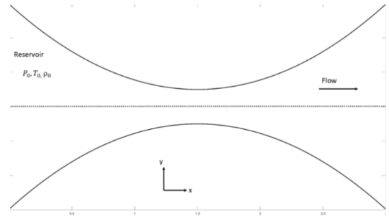
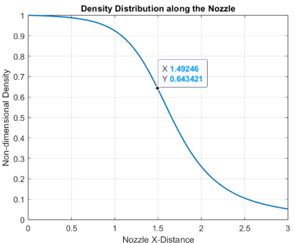
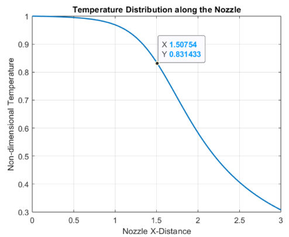
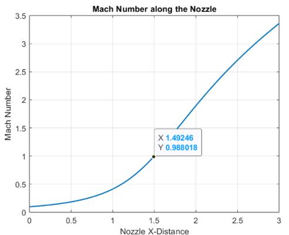
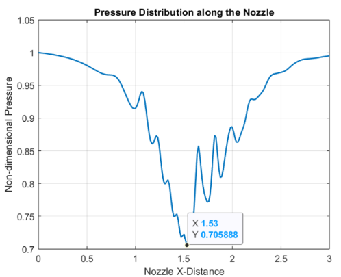
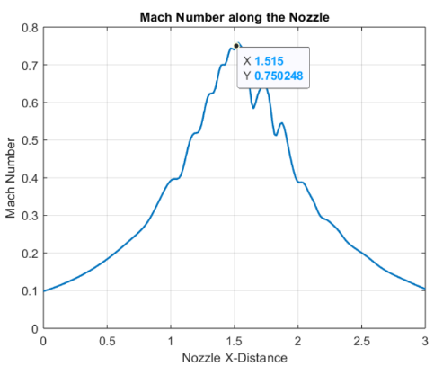

# CFD Simulation of Quasi-1D Isentropic Nozzle Flow

This repository contains the MATLAB source code and final report for a CFD project simulating quasi-one-dimensional, inviscid, compressible flow through a convergent-divergent (CD) nozzle.

The simulation solves the time-dependent, non-dimensionalized Euler equations (in conservation form) to achieve a steady-state solution. The numerical solution is implemented using the **MacCormack's method**, a second-order accurate, two-step predictor-corrector finite difference scheme.

## Project Objectives

* Solve the governing Euler equations using the finite difference method with MacCormack's scheme.
* Simulate two primary flow regimes:
    1.  **Subsonic-Supersonic Flow** (choked flow).
    2.  **Purely Subsonic Flow**.
* Analyze and compare the steady-state distributions of pressure, density, temperature, and Mach number with analytical isentropic flow solutions.

## Methodology

### Nozzle Geometry

The simulation domain is a symmetric CD nozzle with a length of 3 units. The cross-sectional area $A$ is defined by the parabolic function:

$$A = 1 + 2.2(x - 1.5)^2, \quad 0 \le x \le 3$$ 

The throat of the nozzle (minimum area) is located at $x = 1.5$.

*(Image from Figure 2 in the project report )*

### Numerical Scheme

* **Governing Equations:** The non-dimensionalized, conservative forms of the continuity, momentum, and energy equations (Euler equations) are solved.
* **MacCormack's Method:** A two-step explicit predictor-corrector scheme is used for time-marching. It is second-order accurate in both space and time.
* **Time Step Calculation:** To ensure numerical stability, a variable time step $\Delta t$ is calculated at each grid point based on the Courant-Friedrichs-Lewy (CFL) condition. The minimum $\Delta t$ across the domain is used for the next iteration.
    $$\Delta t = C \frac{\Delta x}{a + V}$$ 
    (where $C$ is the Courant number, $a$ is the local speed of sound, and $V$ is the local velocity).

## Key Results

The simulation was run for both flow cases until a converged, steady-state solution was achieved.

### Case 1: Subsonic-Supersonic Flow

This case models choked flow, where the flow accelerates from subsonic at the inlet, reaches $M=1$ exactly at the throat, and expands to supersonic speeds in the diverging section.

* **Boundary Conditions:**
    * **Inlet (Subsonic):** Non-dimensional density ($\rho'$) and temperature ($T'$) are fixed. Velocity ($V'$) is allowed to float.
    * **Outlet (Supersonic):** All variables ($\rho'$, $T'$, $V'$) are allowed to float and are calculated using linear extrapolation from the interior points.

* **Result Plots:** The numerical results show excellent agreement with the analytical isentropic flow solution. The flow correctly passes through Mach 1 near the throat ($x=1.5$).

| Pressure Distribution | Density Distribution |
| :---: | :---: |
|  |  |
| **Temperature Distribution** | **Mach Number Distribution** |
|  |  |
*(Results from Figures 5, 6, 7, and 8 in the project report )*

---

### Case 2: Purely Subsonic Flow

This case models un-choked flow, where the flow accelerates in the converging section and then decelerates in the diverging section, remaining subsonic ($M < 1$) throughout the entire nozzle.

* **Boundary Conditions:**
    * **Inlet (Subsonic):** Same as the supersonic case (fixed $\rho'$, $T'$; floating $V'$).
    * **Outlet (Subsonic):** A fixed non-dimensional exit pressure ($P'$) is specified. $T'$ is extrapolated, and $\rho'$ is calculated from $P'$ and $T'$.

* **Result Plots:** The simulation captures the correct physical trend: the Mach number peaks at the throat at a value less than 1 (approx. 0.75) and then decreases. However, the solution exhibits numerical oscillations, particularly around the throat, which is a common artifact of the numerical scheme in this regime.

| Pressure Distribution | Mach Number Distribution |
| :---: | :---: |
|  |  |
*(Results from Figures 9 and 12 in the project report )*

## Files in This Repository

* `project_report.pdf`: The full final report detailing the governing equations, non-dimensionalization, discretization, and in-depth analysis of the results.
* `subsonic_supersonic_flow.m`: MATLAB script for simulating the sub-supersonic (choked) flow case.
* `subsonic_flow.m`: MATLAB script for simulating the purely subsonic flow case.
